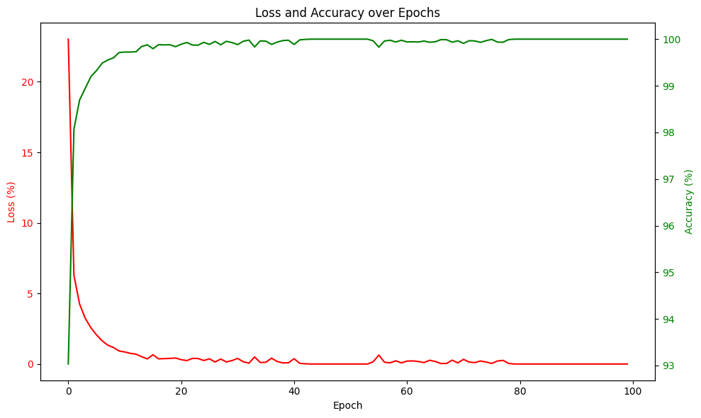
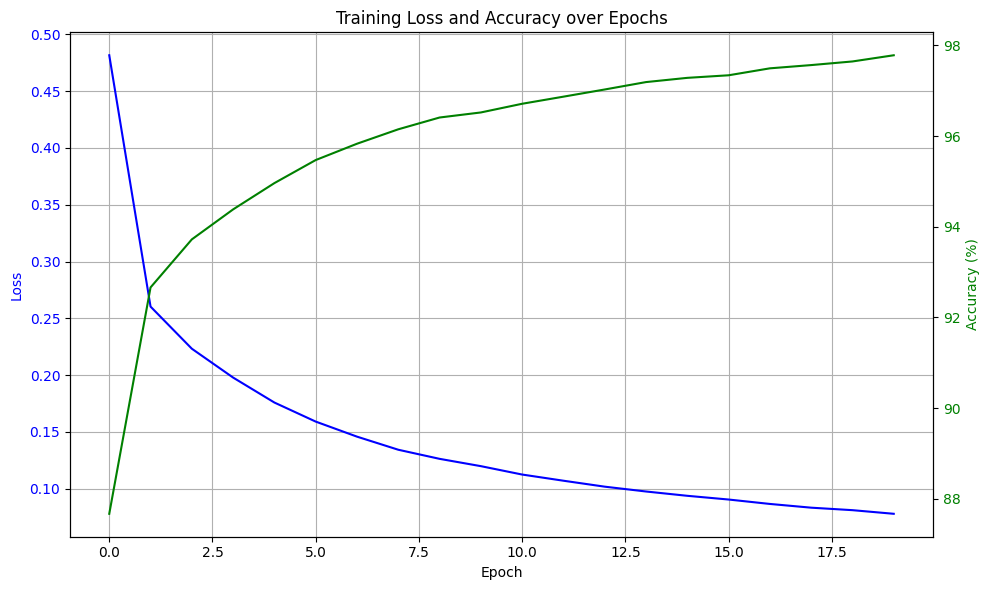

# 🧠 MNIST Digit Classification with Deep CNN (PyTorch) 

This project implements and compares a **Convolutional Neural Network (CNN)** and a basic **Fully Connected Neural Network** for handwritten digit recognition using the **MNIST** dataset. It also visualizes performance with a **confusion matrix**.

---

## 🏗️ Project Overview

- 🔍 Load raw MNIST `.idx` files manually
- 🧠 Build and train both CNN and simple Neural Net
- 📊 Evaluate performance and visualize results
- 💾 Save trained models for later use

---

## 🧠 CNN Architecture

Below is the CNN used in the project. It includes two convolutional layers followed by three fully connected layers, Below is the loss and Accuracy of the model in each epoch:



---

## 🔣 Basic Neural Network

For comparison, a simple fully connected neural network (no convolution) is also implemented ,Below is the loss and Accuracy of the model in each epoch:



---

## 📊 CNN Confusion Matrix

After training the CNN, a confusion matrix is generated on the test ans below is the Output:


---

## 📂 File Structure

```bash
├── Model1.png   <- Neural Network
├── Model2.png   <- Cnn + Neural Network
├── Image_Cnn.png
│── Confusion Matrix.png
├── train-images.idx3-ubyte
├── train-labels.idx1-ubyte
├── t10k-images.idx3-ubyte
├── t10k-labels.idx1-ubyte
├── Image_Neural.png
├── nn_baseline.py # Simple neural network
├── mnist_cnn.pth
└── README.md
```


## 🚀 How to Run

### 1. 📥 Download MNIST Data

Download the following files from [Kaggle MNIST page](https://www.kaggle.com/datasets/hojjatk/mnist-dataset):
- `train-images.idx3-ubyte`
- `train-labels.idx1-ubyte`
- `t10k-images.idx3-ubyte`
- `t10k-labels.idx1-ubyte`

Place them in the same directory as your Python scripts.

### 2. 🧠 Train CNN

```bash
python Model2.py
```
This will:
Train a CNN for 50 epochs
Print training loss per epoch
Save model to mnist_cnn.pth

### 3. 📉 Visualize Results

Make sure your code includes logic to:
Generate and save the confusion matrix (Confusion Matrix.png)
Optionally compare CNN and baseline NN performance


